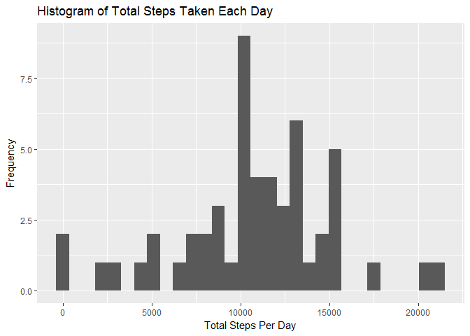
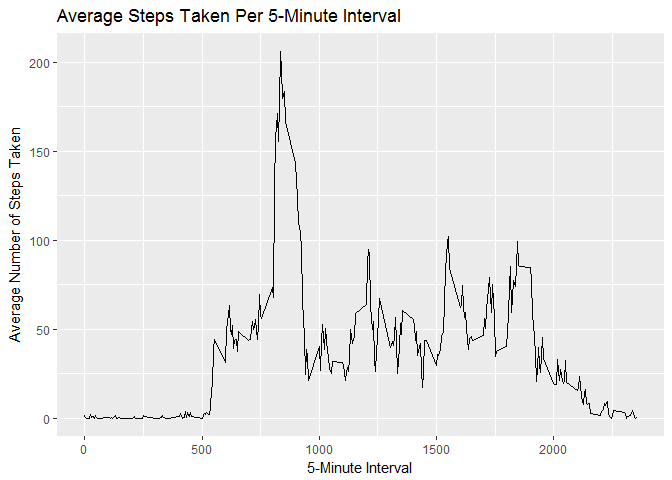
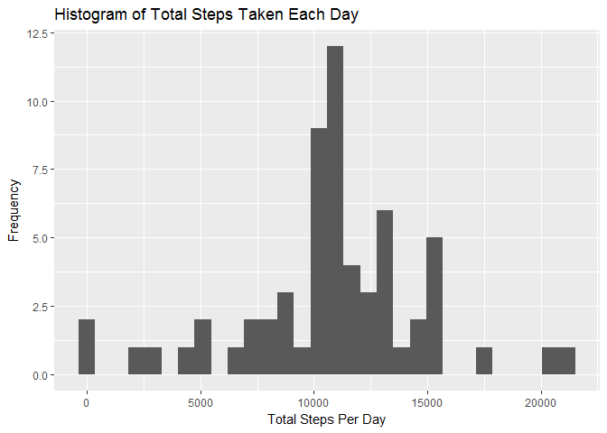
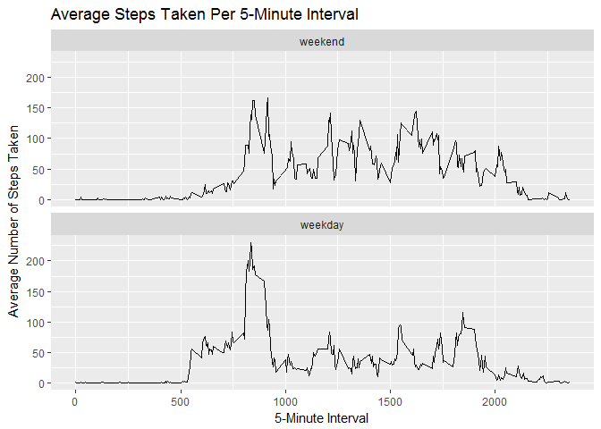

## Loading and preprocessing the data

1. Load the data from zip file in working directory:


```r
#Load required packages
library(dplyr)
library(ggplot2)
```


```r
data <- read.csv(unz("activity.zip", "activity.csv"), header = TRUE,
                 sep = ",")
```

## What is mean total number of steps taken per day?

1. Make a histogram of the total number of steps taken each day


```r
TotalSteps <- data %>%
              filter(!is.na(steps)) %>%
              group_by(date) %>%
              summarise(steps = sum(steps))

qplot(TotalSteps$steps, 
      geom="histogram", 
      xlab = "Total Steps Per Day", 
      ylab = "Frequency", 
      main = "Histogram of Total Steps Taken Each Day")
```

<!-- -->

2. Calculate and report the mean and median of the total number of steps taken per day


```r
totalmean <- format(mean(TotalSteps$steps), scientific = FALSE)
totalmedian <- median(TotalSteps$steps)
```

The mean of the total number of steps taken per day is 10766.19 and the median is 10765

## What is the average daily activity pattern?
1. Make a time series plot (i.e. type = "l") of the 5-minute interval (x-axis) and the average number of steps taken, averaged across all days (y-axis)


```r
AvgStep <- data %>%
              group_by(interval) %>%
              summarise(steps = mean(steps, na.rm = TRUE))

qplot(interval, steps, data = AvgStep, geom = "line") + 
      ylab("Average Number of Steps Taken") +
      xlab("5-Minute Interval") +
      ggtitle("Average Steps Taken Per 5-Minute Interval")
```

<!-- -->

2. Which 5-minute interval, on average across all the days in the dataset, contains the maximum number of steps?


```r
subset(AvgStep, steps == max(steps))
```

```
## # A tibble: 1 x 2
##   interval steps
##      <int> <dbl>
## 1      835   206
```

## Imputing missing values

1. Calculate and report the total number of missing values in the dataset 


```r
missingvalues <- sum(is.na(data$steps))
```

The total number of missing values in the dataset 2304

2. Devise a strategy for filling in all of the missing values in the dataset. The strategy does not need to be sophisticated. For example, you could use the mean/median for that day, or the mean for that 5-minute interval, etc.

Strategy = Mean of the 5 minute interval

3. Create a new dataset that is equal to the original dataset but with the missing data filled in.


```r
ImputedData <- left_join(data, AvgStep, by = "interval")

ImputedData <- ImputedData %>% 
               mutate(steps = coalesce(as.numeric(steps.x),as.numeric(steps.y))) %>%
               select(steps, date, interval)
```

4. Make a histogram of the total number of steps taken each day and Calculate and report the mean and median total number of steps taken per day. Do these values differ from the estimates from the first part of the assignment? What is the impact of imputing missing data on the estimates of the total daily number of steps?


```r
TotalStepsImputed <- ImputedData %>%
                     filter(!is.na(steps)) %>%
                     group_by(date) %>%
                     summarise(steps = sum(steps))

qplot(TotalStepsImputed$steps, 
      geom="histogram", 
      xlab = "Total Steps Per Day", 
      ylab = "Frequency", 
      main = "Histogram of Total Steps Taken Each Day")
```

<!-- -->


```r
imputedmean <- format(mean(TotalStepsImputed$steps), scientific = FALSE)
imputedmedian <- format(median(TotalStepsImputed$steps), scientific = FALSE)
```

The mean of the total number of steps taken per day is 10766.19 and the median is 10766.19

## Are there differences in activity patterns between weekdays and weekends?

1. Create a new factor variable in the dataset with two levels - "weekday" and "weekend" indicating whether a given date is a weekday or weekend day.


```r
ImputedData$Weekend <- factor(weekdays(as.Date(ImputedData$date)) %in% c("Saturday", "Sunday"), 
                   levels=c(TRUE, FALSE), labels=c('weekend', 'weekday'))
```

2. Make a panel plot containing a time series plot (i.e. type = "l") of the 5-minute interval (x-axis) and the average number of steps taken, averaged across all weekday days or weekend days (y-axis).


```r
AvgWeekdayStep <- ImputedData %>%
  group_by(Weekend, interval) %>%
  summarise(steps = mean(steps, na.rm = TRUE))

qplot(interval, steps, data = AvgWeekdayStep, geom = "line", facets = Weekend ~.) +
  ggtitle("Average Steps Taken Per 5-Minute Interval") +
  xlab("5-Minute Interval") +
  ylab("Average Number of Steps Taken")+
  facet_wrap(~Weekend, ncol = 1)
```

<!-- -->


